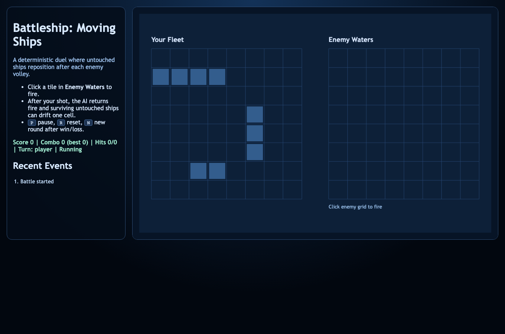
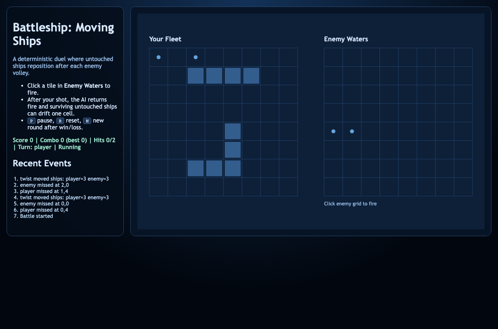

# daily-classic-game-2026-04-22-battleship-moving-ships

<div align="center">
  <p><strong>Deterministic Battleship duel with a moving-fleet twist.</strong></p>
  <p>Fire one shot, absorb the enemy response, then adapt as untouched ships shift position.</p>
</div>

<div align="center">
  
  
</div>

## Quick Start
```bash
pnpm install
pnpm test
pnpm build
pnpm dev
```

## How To Play
- Click cells in the right-side enemy board to fire.
- Each player shot triggers an enemy shot after a short delay.
- Use `P` to pause, `R` to reset, and `N` to restart after victory/defeat.

## Rules
- Fleet: battleship (4), cruiser (3), destroyer (2).
- You and the AI alternate one shot per turn.
- Untouched ships may move by one cell after enemy turns.
- Ships cannot move out of bounds, overlap, or move into previously targeted tiles.

## Scoring
- Hit: `+100`
- Sink: `+250`
- Miss: `-20` (floored at `0`)
- Consecutive hits build a combo tracked in HUD and text render output.

## Twist
- Twist selected: **moving ships**.
- Only ships with no damage can move, preserving tactical value of first contact.
- Movement direction order is seeded, so replayed timelines stay deterministic.

## Verification
```bash
pnpm install
pnpm test
pnpm build
pnpm capture
```

`window.render_game_to_text()` includes phase, score, combo, sink counts, public boards, and recent events for deterministic validation.

## Project Layout
- `src/` game core + browser UI
- `assets/` static assets
- `tests/` deterministic engine tests
- `scripts/` build, self-check, capture
- `docs/plans/` implementation notes + Playwright action payload
- `artifacts/playwright/` screenshots, GIF clips, text render dump
